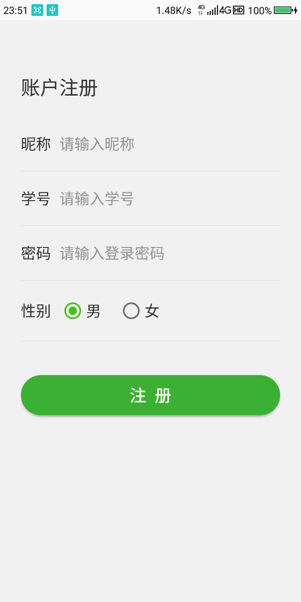

# wechat

安卓大作业，仿微信，简单UI，__未对接后台__，因技术有限，当初为了交作业现学现卖，做了两晚上的成果，代码可能有点粗糙，仅供参考（作业），__可能无法应用于实际项目__，曾经被大神级学长 评价为 __“老人版微信”__

## 开发环境

> Android Studio

> jdk1.8

>安卓版本,抱歉，忘记了，这项目很久了

## 使用教程

把代码克隆到本地，用AS打开项目，按照提示安装依赖（可能需要科学上网），OK
碰到问题可以骚扰：email:lcujn@qq.com

## 其他说明

当初自己好像最喜欢的一点，就是使用了.9.png，实现了qq聊天气泡的效果。当初还自豪了好久，哈哈哈哈，当时年轻嘛~~
如果大家有需要（一定要让我知道呀），以后会抽时间维护一下的，这个项目交了作业后就再也没打开过，还是今天整理硬盘时才看到

## 截图预览

    
    

        <em>登录页面</em>
    

    
    

        <em>注册页面</em>
    

    
    

        <em>好友记录</em>
    

    
    

        <em>历史记录</em>
    

    
    

        <em>个人中心</em>
    

    
    

        <em>聊天页面</em>
    

